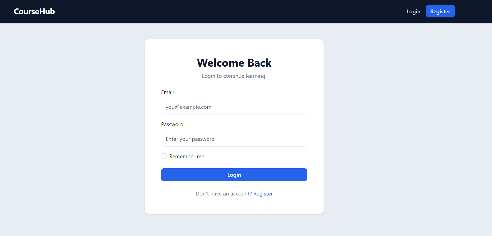
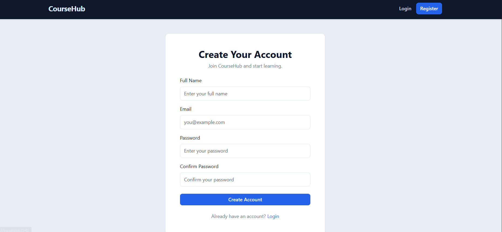

````markdown
# 🎓 CourseHub

> A modern Learning Management System built with ASP.NET Core MVC.

CourseHub is a web-based learning platform that allows students to discover and enroll in courses, instructors to create and manage their courses, and administrators to manage the platform.

The project was built to apply real-world backend and web development concepts using **C#, ASP.NET Core MVC, Entity Framework Core, SQL Server, ASP.NET Core Identity, Role-Based Authorization, LINQ, AutoMapper, CRUD operations, pagination, and file uploading**.

---

## 🌐 Project Repository

🔗 **GitHub:**  
https://github.com/aymanragab8/CourseHub

---

# 📌 Project Overview

CourseHub provides a complete environment for managing and consuming online courses.

The application supports three different user roles:

- 🛡️ **Admin**
- 👨‍🏫 **Instructor**
- 👨‍🎓 **Student**

Each role has its own permissions and functionality.

The system was designed using the **ASP.NET Core MVC** pattern with Entity Framework Core for database access and ASP.NET Core Identity for authentication and authorization.

---

# ✨ Features

## 🔐 Authentication & Authorization

- User Registration
- User Login
- User Logout
- ASP.NET Core Identity
- Password hashing
- Role-Based Authorization
- Protected controller actions
- Role-specific dashboards
- Authentication-based navigation

---

## 👥 User Roles

### 🛡️ Admin

The Admin has administrative control over the platform.

Admin capabilities include:

- Access Admin Dashboard
- Manage courses
- Manage categories
- Assign instructors to courses
- View platform-related statistics
- Access administrative functionality

---

### 👨‍🏫 Instructor

Instructors are responsible for creating and managing their courses.

Instructor capabilities include:

- Access Instructor Dashboard
- View their own courses
- Create courses
- Edit courses
- Delete courses
- Upload course images
- Select course categories
- Set course prices
- Set enrollment deadlines
- View enrollment statistics
- View the number of unique students

When an instructor creates a course, the course is associated with the currently authenticated instructor.

---

### 👨‍🎓 Student

Students use CourseHub to discover and enroll in courses.

Student capabilities include:

- Browse available courses
- View course details
- Enroll in courses
- Access Student Dashboard
- View enrolled courses

---

# 📚 Course Management

CourseHub provides course management functionality.

A course contains information such as:

- Title
- Description
- Price
- Category
- Instructor
- Enrollment Deadline
- Image
- Creation Date

The system applies role-based permissions to determine who can create, edit, or manage courses.

---

# 🖼️ Course Image Upload

CourseHub supports uploading course images from the user's local machine.

When creating a course, an instructor or administrator can upload an image.

The course creation form uses:

```html
enctype="multipart/form-data"
````

to support file uploads.

If no image is uploaded, the application uses a default course image.

---

# 📝 Course Enrollment

Students can enroll in available courses.

The enrollment relationship connects students with courses through the `Enrollment` entity.

```text
Student
   │
   │
   ▼
Enrollment
   │
   │
   ▼
Course
```

This allows the system to determine:

* Which courses a student is enrolled in
* Which students are enrolled in a course
* Total enrollments
* Unique students associated with an instructor

---

# 📊 Dashboards

CourseHub provides separate dashboards based on the authenticated user's role.

## 🛡️ Admin Dashboard

The Admin Dashboard provides access to administrative functionality and platform management.

---

## 👨‍🏫 Instructor Dashboard

The Instructor Dashboard provides statistics and information related to the instructor's courses.

Examples include:

* Total courses
* Total enrollments
* Unique students
* Instructor's courses

---

## 👨‍🎓 Student Dashboard

The Student Dashboard provides students with access to their learning-related information and enrolled courses.

---

# 📑 Pagination

CourseHub uses pagination to efficiently display courses.

Instead of loading all records at once, the application retrieves only the records required for the current page.

Database-level pagination is implemented using:

```csharp
Skip()
Take()
```

This helps improve performance when working with larger datasets.

---

# 🗂️ Course Categories

Courses can be organized into categories.

Each course is associated with a category, allowing courses to be grouped and displayed in an organized way.

Categories are loaded dynamically when creating courses.

---

# 🗄️ Database

CourseHub uses:

**Microsoft SQL Server**

Entity Framework Core is used as the ORM for database communication.

The project follows the **Code First** approach and uses EF Core migrations to manage database schema changes.

Main entities include:

* ApplicationUser
* Course
* Category
* Enrollment

The application also uses ASP.NET Core Identity tables for user and role management.

---

# 🔄 Entity Framework Core

Entity Framework Core is responsible for:

* Database communication
* Entity mapping
* CRUD operations
* LINQ queries
* Relationships
* Migrations
* Pagination
* Data retrieval

Example relationships:

```text
Category
   │
   └── Courses


Instructor
   │
   └── Courses


Student
   │
   └── Enrollments
          │
          └── Course
```

---

# 🔑 ASP.NET Core Identity

CourseHub uses **ASP.NET Core Identity** for user authentication and management.

Identity provides:

* User registration
* Login
* Logout
* Password management
* Password hashing
* User information
* Roles
* Authorization
* Security-related functionality

The application also uses a custom application user model to store additional user information such as the user's full name.

---

# 🛡️ Role-Based Authorization

Access to different parts of the application is controlled using roles.

The main roles are:

```text
Admin
Instructor
Student
```

Example:

```text
Admin
   ↓
Admin Dashboard

Instructor
   ↓
Instructor Dashboard

Student
   ↓
Student Dashboard
```

Role checks are also used inside Razor Views to display the appropriate navigation options and functionality.

---

# 🎨 User Interface

The frontend uses:

* HTML5
* CSS3
* Bootstrap
* Bootstrap Icons
* JavaScript
* Razor Views

The application includes a responsive and modern interface with:

* Responsive Navbar
* Role-based navigation
* Course Cards
* Forms
* Tables
* Alerts
* Pagination
* Dashboards
* Responsive layouts
* Course image previews

---

# 🏗️ Architecture

CourseHub follows the **ASP.NET Core MVC** architectural pattern.

The main components are:

```text
Model
   ↓
View
   ↓
Controller
```

### Models

Models represent the application's entities and database data.

Examples:

* Course
* Category
* Enrollment
* ApplicationUser

---

### Views

Razor Views are responsible for displaying the application's user interface.

Main view areas include:

* Home
* Account
* Courses
* Admin
* Instructor
* Student
* Shared

---

### Controllers

Controllers handle HTTP requests and coordinate application behavior.

Examples include:

* HomeController
* AccountController
* CoursesController
* AdminController
* InstructorController
* StudentController

---

# 📁 Project Structure

```text
CourseHub
│
├── CourseHub
│   │
│   ├── Controllers
│   │   ├── AccountController.cs
│   │   ├── AdminController.cs
│   │   ├── CoursesController.cs
│   │   ├── HomeController.cs
│   │   ├── InstructorController.cs
│   │   └── StudentController.cs
│   │
│   ├── Data
│   │   └── ApplicationDbContext.cs
│   │
│   ├── Models
│   │   ├── ApplicationUser.cs
│   │   ├── Course.cs
│   │   ├── Category.cs
│   │   ├── Enrollment.cs
│   │   └── ...
│   │
│   ├── ViewModels
│   │   ├── CreateCourseViewModel.cs
│   │   └── ...
│   │
│   ├── Views
│   │   ├── Account
│   │   ├── Admin
│   │   ├── Courses
│   │   ├── Home
│   │   ├── Instructor
│   │   ├── Student
│   │   └── Shared
│   │
│   ├── wwwroot
│   │   ├── css
│   │   ├── js
│   │   ├── images
│   │   └── lib
│   │
│   ├── Migrations
│   │
│   ├── Program.cs
│   ├── appsettings.json
│   └── CourseHub.csproj
│
├── docs
│   └── screenshots
│
├── CourseHub.sln
└── README.md
```

---

# 🛠️ Technologies Used

| Technology            | Purpose                        |
| --------------------- | ------------------------------ |
| C#                    | Main programming language      |
| .NET 10               | Application framework          |
| ASP.NET Core MVC      | Web application framework      |
| Entity Framework Core | ORM and database access        |
| SQL Server            | Relational database            |
| ASP.NET Core Identity | Authentication & authorization |
| AutoMapper            | Object mapping                 |
| Bootstrap             | Responsive UI                  |
| Bootstrap Icons       | UI icons                       |
| HTML5                 | Page structure                 |
| CSS3                  | Styling                        |
| JavaScript            | Client-side functionality      |
| Razor Views           | Server-side UI                 |
| Git                   | Version control                |
| GitHub                | Source code hosting            |

---

# ⚙️ Requirements

Before running CourseHub, make sure you have:

* .NET 10 SDK
* SQL Server
* Visual Studio 2022 or later
* Git

---

# 🚀 Getting Started

## 1. Clone the Repository

```bash
git clone https://github.com/aymanragab8/CourseHub.git
```

Navigate to the project directory:

```bash
cd CourseHub
```

---

# 2. Configure the Database

Open:

```text
appsettings.json
```

Configure the SQL Server connection string according to your local environment.

Example:

```json
{
  "ConnectionStrings": {
    "DefaultConnection": "Server=localhost;Database=CourseHub;Trusted_Connection=True;TrustServerCertificate=True;"
  }
}
```

> ⚠️ Do not commit production passwords, API keys, or other sensitive credentials to GitHub.

---

# 3. Apply Database Migrations

Using the .NET CLI:

```bash
dotnet ef database update
```

Or using Visual Studio Package Manager Console:

```powershell
Update-Database
```

If you need to create a new migration:

```powershell
Add-Migration MigrationName
```

Then apply it:

```powershell
Update-Database
```

---

# 4. Run the Application

From Visual Studio:

1. Open `CourseHub.sln`
2. Make sure SQL Server is running
3. Verify the database connection string
4. Build the solution
5. Run the application

Or use:

```bash
dotnet run
```

---

# 🔐 Authentication Flow

The general authentication flow is:

```text
Register
   ↓
Login
   ↓
Authentication
   ↓
Role Detection
   ↓
Role-Based Access
   ↓
Dashboard
```

After authentication, the application identifies the user's role and provides access to the appropriate features.

---

# 🔄 Course Creation Flow

### Instructor

```text
Instructor Dashboard
        ↓
My Courses
        ↓
Create Course
        ↓
Enter Course Information
        ↓
Select Category
        ↓
Set Price
        ↓
Set Enrollment Deadline
        ↓
Upload Image
        ↓
Create Course
        ↓
Course Saved
```

### Admin

Administrators can create courses and select the instructor responsible for the course.

---

# 📸 Screenshots

The project screenshots are stored in:

```text
docs/screenshots/
```

### 🔐 Login Page



### 📝 Register Page



## 🏠 Home Page


---

## 📚 Courses


---

## 📖 Course Details


---

## 🛡️ Admin Dashboard


---

## 👨‍🏫 Instructor Dashboard


---

## 👨‍🎓 Student Dashboard


---

## ➕ Create Course


---

# ✅ Validation

CourseHub uses server-side validation through ASP.NET Core MVC and ViewModels.

Validation is applied to forms such as:

* Registration
* Login
* Course Creation
* Course Editing

Validation messages are displayed directly in the UI.

---

# 🚨 Error & User Feedback

The application provides user feedback using success and error alerts.

Examples include:

* Successful course creation
* Successful operations
* Validation errors
* Failed operations

Temporary messages are displayed using ASP.NET Core `TempData`.

---

# 📊 Instructor Statistics

The Instructor Dashboard retrieves statistics from the database using Entity Framework Core and LINQ.

Examples include:

```text
Total Courses
Total Enrollments
Unique Students
```

The statistics are calculated based on the currently authenticated instructor.

---

# 🔒 Security

CourseHub uses ASP.NET Core's built-in security mechanisms.

Security-related features include:

* ASP.NET Core Identity
* Password hashing
* Authentication
* Role-Based Authorization
* Protected controller actions
* Anti-forgery protection
* Server-side validation

Sensitive configuration values should be stored securely and should not be committed to source control.

---

# 🎯 Project Goals

The main goal of CourseHub was to build a realistic ASP.NET Core MVC application while applying practical software development concepts.

The project demonstrates experience with:

* C#
* ASP.NET Core MVC
* Entity Framework Core
* SQL Server
* ASP.NET Core Identity
* Role-Based Authorization
* CRUD Operations
* LINQ
* Database Relationships
* Pagination
* ViewModels
* AutoMapper
* File Uploads
* Responsive UI
* Git & GitHub

---

# 📚 What I Learned

Building CourseHub provided practical experience in developing a complete web application from database design to user interface.

The project helped reinforce the relationship between the different application layers:

```text
User Interface
      ↓
Razor Views
      ↓
Controllers
      ↓
ViewModels / Models
      ↓
Entity Framework Core
      ↓
SQL Server
```

It also provided practical experience implementing:

* Authentication
* Authorization
* Role-based access
* CRUD operations
* Database relationships
* Pagination
* File uploads
* Dashboard statistics
* Form validation
* Responsive UI

---

# 🚧 Future Improvements

Possible future improvements include:

* ⭐ Course ratings and reviews
* 🔎 Advanced course search
* 🏷️ Advanced course filtering
* 👤 Instructor profiles
* 📈 Student progress tracking
* 🎥 Video lessons
* 💳 Online payment integration
* 📧 Email verification
* 🔑 Password reset through email
* 🔔 Notifications
* 🧪 Unit and integration testing
* 🌐 RESTful API
* ☁️ Cloud deployment

---

# 👨‍💻 Author

## Ayman Ragab

**Software Engineer | Backend .NET Developer**

### GitHub

https://github.com/aymanragab8

### CourseHub Repository

https://github.com/aymanragab8/CourseHub

### LinkedIn

https://www.linkedin.com/in/ayman-ragab8

---

# ⭐ Support

If you find this project useful or interesting, consider giving the repository a ⭐ on GitHub.

---

# 📄 License

This project was created for educational and portfolio purposes.

```
```
